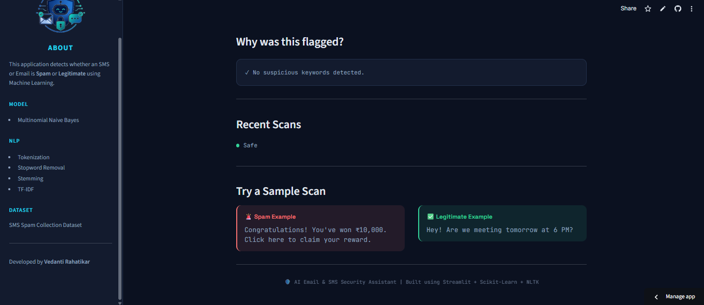

# 🛡️ AI Email & SMS Security Assistant

> A Machine Learning-powered web application that detects whether an SMS or Email is **Spam** or **Legitimate** using Natural Language Processing (NLP).

---

## 🌐 Live Demo

🔗 https://spam-sms-classifier-123.streamlit.app

---

## 📸 Application Preview

### 🏠 Home Page

<p align="center">
  
</p>

### ✅ Legitimate Message Detection

<p align="center">
  
</p>

<p align="center">
  
</p>

---

## ✨ Features

- 🚨 Detects Spam & Legitimate SMS/Emails
- 🤖 Machine Learning based prediction
- 📝 NLP preprocessing
  - Tokenization
  - Stopword Removal
  - Stemming
  - TF-IDF Vectorization
- 📊 Confidence Score
- ⚠️ Threat Level Indicator
- 📋 Prediction History
- 🎨 Modern Dark UI
- 🌐 Live Deployment using Streamlit Community Cloud

---

## 🧠 Machine Learning Pipeline

Message
↓
Text Preprocessing
↓
Tokenization
↓
Stopword Removal
↓
Stemming
↓
TF-IDF Vectorization
↓
Multinomial Naive Bayes
↓
Prediction

---

## 🛠 Tech Stack

| Category | Technologies |
|----------|--------------|
| Language | Python |
| Framework | Streamlit |
| Machine Learning | Scikit-learn |
| NLP | NLTK |
| Data Processing | NumPy, Pandas |
| Version Control | Git & GitHub |
| Deployment | Streamlit Community Cloud |

---

## 📂 Project Structure

```text
spamSmsClassifier/
│
├── app.py
├── requirements.txt
├── README.md
│
├── assets/
│   ├── logo.png
│   └── style.css
│
├── dataset/
│   └── spam.csv
│
├── model/
│   ├── model.pkl
│   └── vectorizer.pkl
│
├── notebook/
│   └── sms-spam-detection.ipynb
│
├── screenshots/
│   └── home.png
│
└── utils/
    ├── helper.py
    └── preprocess.py
```

---

## 🚀 Installation

Clone the repository

```bash
git clone https://github.com/RVedanti/Spam-Sms-Classifier.git
```

Move into the project

```bash
cd Spam-Sms-Classifier
```

Install dependencies

```bash
pip install -r requirements.txt
```

Run the application

```bash
streamlit run app.py
```

---

## 📊 Dataset

**SMS Spam Collection Dataset**

- Contains labelled SMS messages
- Categories:
  - Spam
  - Ham (Legitimate)

---

## 📈 Model Used

- **Multinomial Naive Bayes**

### NLP Techniques

- Tokenization
- Stopword Removal
- Stemming
- TF-IDF Vectorization

---

## 🎯 Future Improvements

- Email phishing detection
- URL reputation analysis
- Multiple ML model comparison
- Explainable AI predictions
- User feedback system

---

## 👩‍💻 Developer

**Vedanti Rahatikar**

GitHub: https://github.com/RVedanti

---

## ⭐ Support

If you found this project helpful, consider giving it a ⭐ on GitHub.
